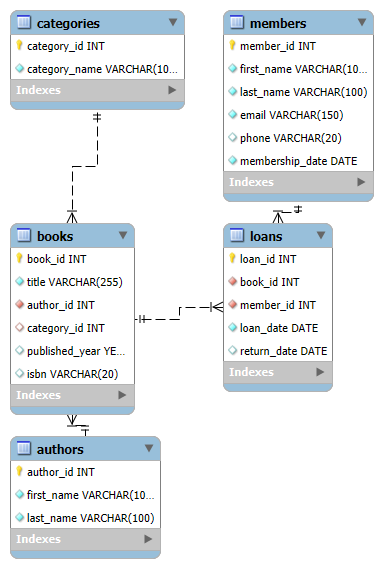

# Library Management Database

## Description
This project contains the MySQL database schema for a Library Management System. It includes tables for authors, categories, books, members, and loans with proper constraints and relationships.

## Setup
1. Install MySQL and MySQL Workbench.
2. Import the SQL schema using the command:  
   `mysql -u username -p dbname < library_management.sql`
3. Use MySQL Workbench to visualize and manage the database; see ERD diagram in the repo.

## ERD Diagram

